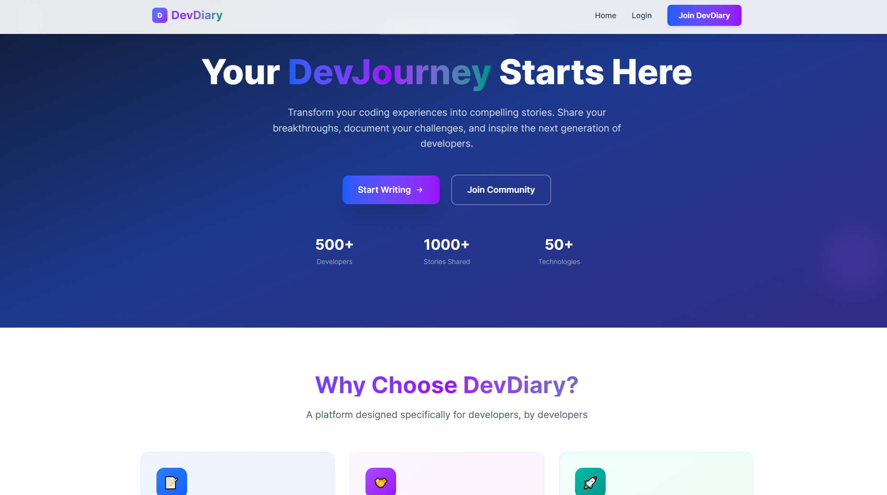
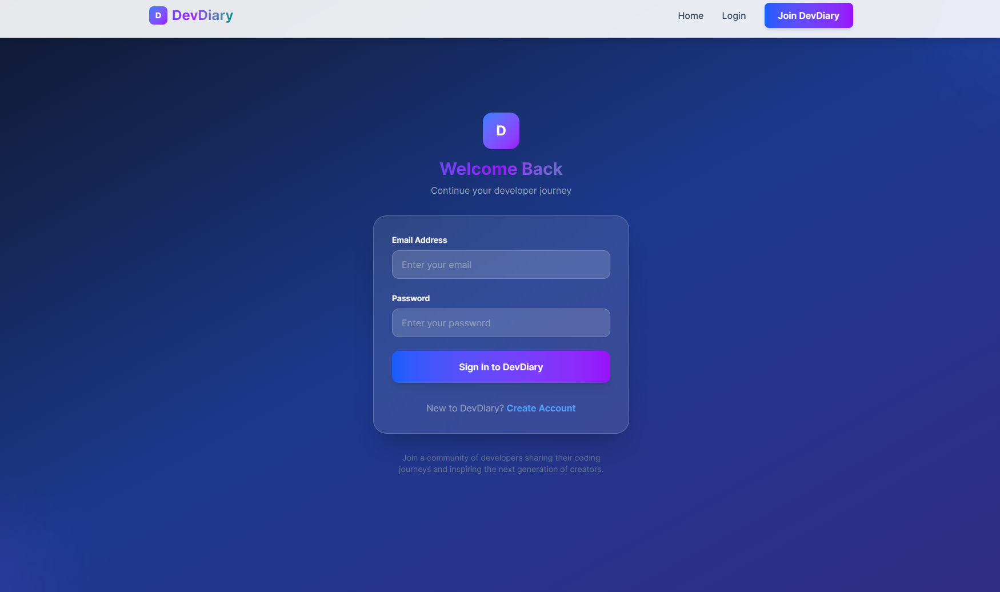
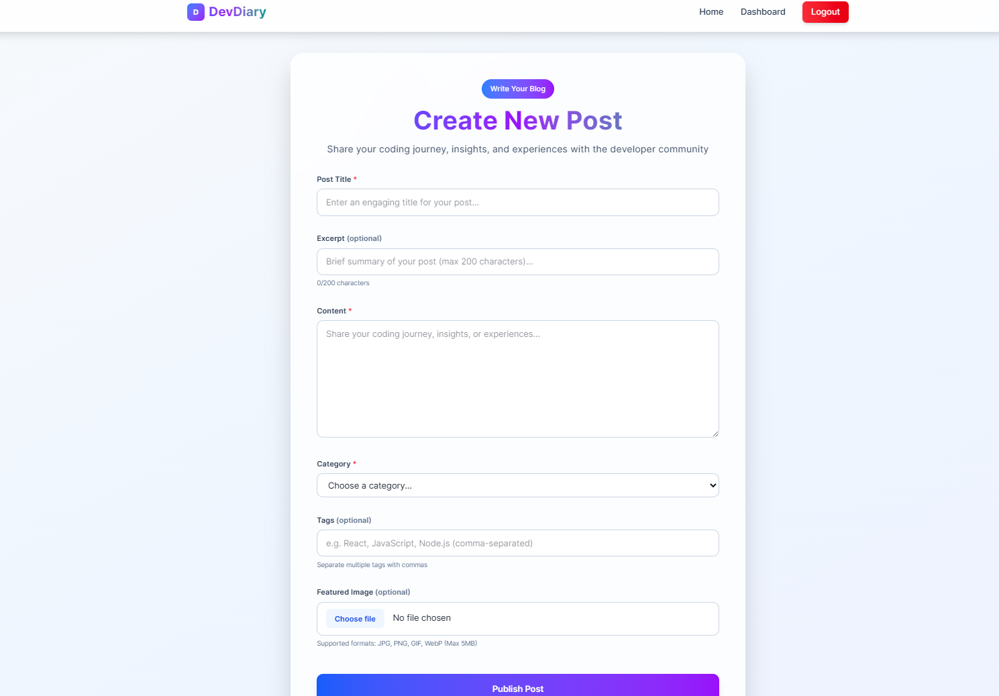
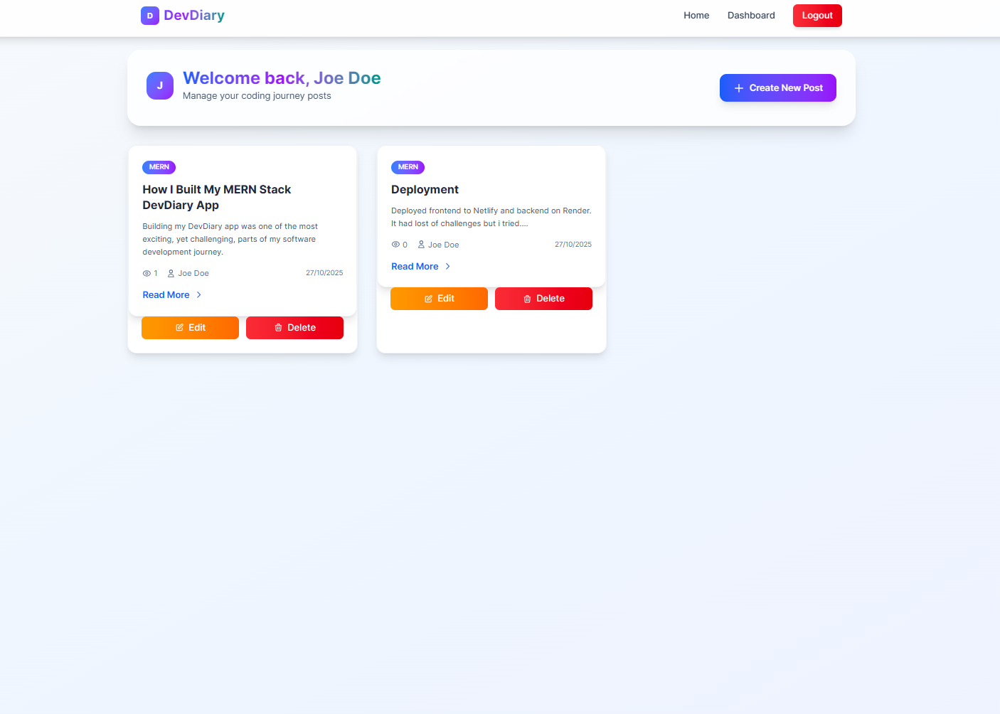
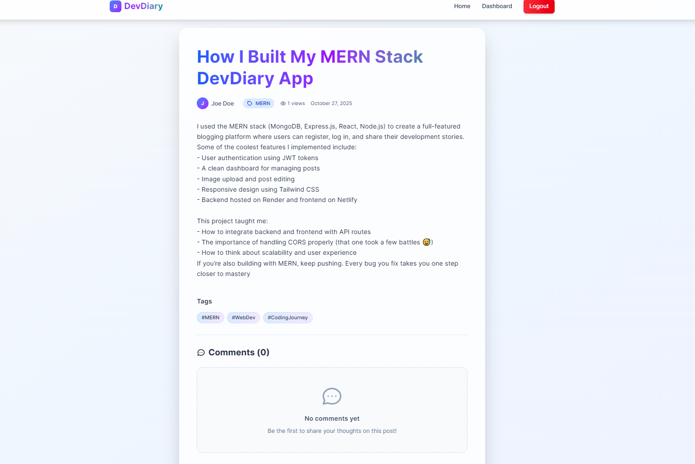

# DevDiary - MERN Stack Blog Application

## Project Overview

DevDiary is a full-stack MERN (MongoDB, Express.js, React.js, Node.js) blog application that demonstrates seamless integration between front-end and back-end components. The application allows users to create, read, update, and delete blog posts, manage categories, and includes user authentication features.

## Tech Stack

### Frontend
- **React 19.1.1** - Modern React with hooks and functional components
- **React Router DOM 7.9.4** - Client-side routing
- **Tailwind CSS 4.1.15** - Utility-first CSS framework
- **Axios 1.12.2** - HTTP client for API calls
- **Lucide React 0.546.0** - Icon library
- **Vite 7.1.7** - Build tool and development server

### Backend
- **Node.js** with **Express.js 5.1.0** - Server framework
- **MongoDB Atlas** with **Mongoose 8.19.2** - Database and ODM
- **JWT 9.0.2** - JSON Web Tokens for authentication
- **bcryptjs 3.0.2** - Password hashing
- **express-validator 7.3.0** - Input validation
- **CORS 2.8.5** - Cross-origin resource sharing


## Deployment

The application has been deployed as follows:

- **Frontend Client**: Deployed on Netlify - [Live App](https://devdiaryblog.netlify.app/)
- **Backend Server**: Hosted on Render - [API Server](https://mern-stack-integration-vee-kodes.onrender.com)
- **Source Code**: Pushed to GitHub - [Repository](https://github.com/PLP-MERN-Stack-Development/mern-stack-integration-vee-kodes)


## Project Structure

```
mern-stack-integration-vee-kodes/
├── client/                          # React frontend
│   ├── public/                      # Static assets
│   ├── src/
│   │   ├── components/              # Reusable UI components
│   │   │   ├── Footer.jsx          # Site footer
│   │   │   ├── Loader.jsx          # Loading spinner
│   │   │   ├── Navbar.jsx          # Navigation bar with auth
│   │   │   └── PostCard.jsx        # Blog post preview card
│   │   ├── pages/                  # Page components
│   │   │   ├── About.jsx           # About page
│   │   │   ├── Contact.jsx         # Contact form page
│   │   │   ├── CreatePost.jsx      # Create new post form
│   │   │   ├── Dashboard.jsx       # User dashboard
│   │   │   ├── EditPost.jsx        # Edit existing post
│   │   │   ├── Home.jsx            # Homepage with posts list
│   │   │   ├── Login.jsx           # User login
│   │   │   ├── PostDetail.jsx      # Individual post view
│   │   │   └── Register.jsx        # User registration
│   │   ├── context/                # React context providers
│   │   │   └── AuthContext.jsx     # Authentication state
│   │   ├── hooks/                  # Custom React hooks
│   │   │   └── useApi.js           # API call hook
│   │   ├── services/               # API service layer
│   │   │   └── api.js              # Axios configuration
│   │   ├── App.jsx                 # Main app component
│   │   ├── index.css               # Global styles with Tailwind
│   │   └── main.jsx                # App entry point
│   ├── package.json
│   ├── vite.config.js              # Vite configuration
├── server/                         # Express backend
│   ├── config/
│   │   └── db.js                   # MongoDB connection
│   ├── controllers/                # Route controllers
│   │   ├── authController.js       # Authentication logic
│   │   ├── categoriesController.js # Category management
│   │   └── postsController.js      # Post CRUD operations
│   ├── middleware/
│   │   └── auth.js                 # JWT authentication middleware
│   ├── models/                     # Mongoose schemas
│   │   ├── Category.js             # Category model
│   │   ├── Post.js                 # Post model with comments
│   │   └── User.js                 # User model
│   ├── routes/                     # API routes
│   │   ├── auth.js                 # Auth endpoints
│   │   ├── categories.js           # Category endpoints
│   │   └── posts.js                # Post endpoints                   # File uploads directory
│   ├── server.js                   # Main server file
│   └── package.json
├── README.md                       # Project overview
├── README-DevDiary.md              # This file with project documentation
└── Week4-Assignment.md             # Assignment instructions
```

## Features Implemented

### Core Features
- ✅ **User Authentication**: Registration, login, logout with JWT tokens
- ✅ **Blog Post CRUD**: Create, read, update, delete posts
- ✅ **Categories**: Organize posts by categories
- ✅ **Comments System**: Users can comment on posts
- ✅ **Image Uploads**: Featured images for posts
- ✅ **Responsive Design**: Mobile-friendly UI with Tailwind CSS
- ✅ **Search & Filter**: Search posts by title/content, filter by category

### Advanced Features
- ✅ **Protected Routes**: Authentication-required pages
- ✅ **Dashboard**: User-specific post management
- ✅ **Rich Text Content**: Full blog post content display
- ✅ **View Counter**: Track post popularity
- ✅ **Slug-based URLs**: SEO-friendly post URLs
- ✅ **Loading States**: Proper UX during API calls
- ✅ **Error Handling**: Comprehensive error management

## API Endpoints

### Authentication
- `POST /api/auth/register` - User registration
- `POST /api/auth/login` - User login
- `GET /api/auth/me` - Get current user info

### Posts
- `GET /api/posts` - Get all posts (with pagination, search, filter)
- `GET /api/posts/:id` - Get single post by ID
- `POST /api/posts` - Create new post (authenticated)
- `PUT /api/posts/:id` - Update post (author only)
- `DELETE /api/posts/:id` - Delete post (author only)

### Categories
- `GET /api/categories` - Get all categories
- `POST /api/categories` - Create new category (authenticated)

## Database Models

### User Model
```javascript
{
  username: String (required, unique),
  email: String (required, unique),
  password: String (required, hashed),
  createdAt: Date
}
```

### Post Model
```javascript
{
  title: String (required),
  content: String (required),
  featuredImage: String,
  slug: String (required, unique),
  excerpt: String,
  author: ObjectId (ref: User),
  category: ObjectId (ref: Category),
  isPublished: Boolean (default: true),
  viewCount: Number (default: 0),
  comments: [{
    user: ObjectId (ref: User),
    content: String,
    createdAt: Date
  }],
  createdAt: Date,
  updatedAt: Date
}
```

### Category Model
```javascript
{
  name: String (required, unique),
  slug: String (required, unique),
  description: String,
  createdAt: Date
}
```

## Installation & Setup

### Prerequisites
- Node.js (v18 or higher)
- MongoDB (local or MongoDB Atlas)
- npm or yarn

### Backend Setup
```bash
cd server
npm install
# Create .env file with:
# MONGO_URI=mongodb://localhost:27017/devdiary
# JWT_SECRET=your_jwt_secret
# PORT=5000
npm run dev
```

### Frontend Setup
```bash
cd client
npm install
npm run dev
```

### Environment Variables
Create `.env` files in both client and server directories:

**Server (.env)**
```
MONGO_URI=mongodb://localhost:27017/devdiary
JWT_SECRET=your_super_secret_jwt_key
PORT=5000
```

**Client (.env)**
```
VITE_API_URL=http://localhost:5000/api
```

## Screenshots

Screenshots are located in the `screenshots/` folder.

- **Homepage**: 
- **Login Page**: 
- **Create Post**: 
- **Dashboard**: 
- **Post Detail**: 


## Development Notes

### Challenges Faced
1. **JWT Authentication**: Implementing stateless authentication with proper token validation and refresh mechanisms
2. **File Upload Handling**: Setting up multer for image uploads with proper validation and storage
3. **State Management**: Coordinating authentication state across components using React Context

### Key Learnings
- MERN stack integration patterns and best practices
- JWT-based authentication flow
- File upload handling in Express.js
- React hooks for complex state management
- MongoDB aggregation pipelines for advanced queries
- Responsive design with Tailwind CSS
- API design and RESTful conventions

### Future Enhancements
- [ ] Add pagination for comments
- [ ] Implement post likes/favorites
- [ ] Add user profiles and avatars
- [ ] Email notifications for new comments
- [ ] Admin panel for content moderation
- [ ] Social media sharing
- [ ] Dark mode toggle
- [ ] Real-time notifications with WebSockets

## Scripts

### Server
- `npm start` - Production server
- `npm run dev` - Development server with nodemon

### Client
- `npm run dev` - Development server
- `npm run build` - Production build
- `npm run preview` - Preview production build
- `npm run lint` - Run ESLint

## Contributing

This is an assignment project for PLP Africa Software Engineering course. For contributions or questions, please refer to the assignment guidelines in [Week4-Assignment.md](Week4-Assignment.md).

## License

ISC License